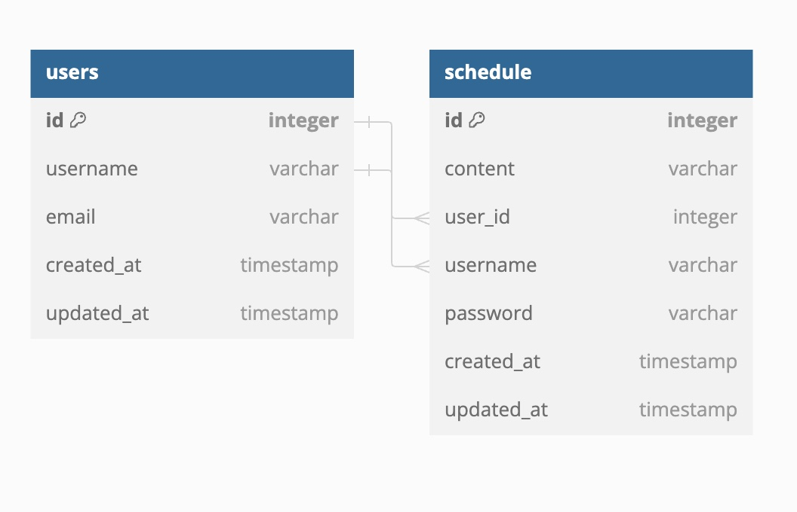

# ERD


# API Documentation


#### 1. 스케줄 조회 (ID로 조회)
- **Endpoint**: `/schedule/{id}`
- **Method**: `GET`
- **Description**: 주어진 ID에 해당하는 스케줄을 조회합니다.
- **Response**:
    - `200 OK`: 요청이 성공적으로 처리되었으며, 스케줄이 반환됩니다.
    - `404 Not Found`: 해당 ID에 대한 스케줄이 존재하지 않습니다.
- **Response Body**:
    ```json
    {
        "id": 1,
        "username": "jhwook",
        "content": "This is a schedule content.",
        "updatedAt": "2024-08-13"
    }
    ```

#### 2. 스케줄 수정
- **Endpoint**: `/schedule/{id}`
- **Method**: `PUT`
- **Description**: 주어진 ID에 해당하는 스케줄을 수정합니다.
- **Request Body**:
    ```json
    {
        "username": "jhwook",
        "password": "1234",
        "content": "Updated schedule content."
    }
    ```
- **Response**:
    - `200 OK`: 요청이 성공적으로 처리되었으며, 업데이트된 스케줄이 반환됩니다.
    - `404 Not Found`: 해당 ID에 대한 스케줄이 존재하지 않습니다.
- **Response Body**:
    ```json
    {
        "id": 1,
        "username": "jhwook",
        "content": "Updated schedule content.",
        "updatedAt": "2024-08-13"
    }
    ```

#### 3. 스케줄 생성
- **Endpoint**: `/schedule`
- **Method**: `POST`
- **Description**: 새로운 스케줄을 생성합니다.
- **Request Body**:
    ```json
    {
        "username": "jhwook",
        "password": "1234",
        "content": "New schedule content."
    }
    ```
- **Response**:
    - `200 OK`: 새로운 스케줄이 성공적으로 생성되었습니다.
- **Response Body**:
    ```json
    {
        "id": 2,
        "username": "john_doe",
        "content": "New schedule content.",
        "createdAt": "2024-08-13",
        "updatedAt": "2024-08-13"
    }
    ```

#### 4. 스케줄 삭제
- **Endpoint**: `/schedule/{id}`
- **Method**: `DELETE`
- **Description**: 주어진 ID에 해당하는 스케줄을 삭제합니다.
- **Response**:
    - `200 OK`: 요청이 성공적으로 처리되었으며, 스케줄이 삭제되었습니다.
    - `404 Not Found`: 해당 ID에 대한 스케줄이 존재하지 않습니다.


